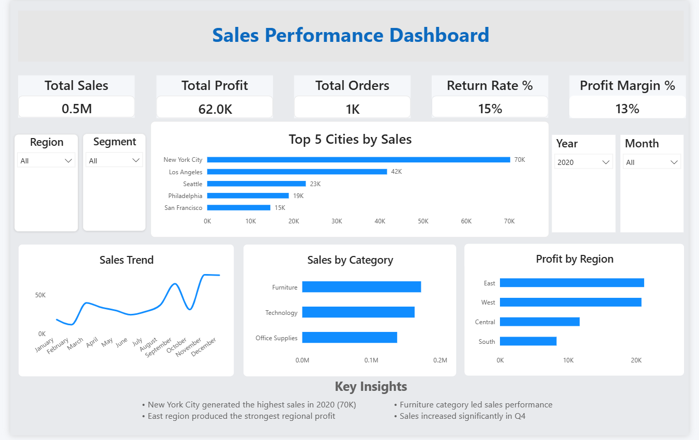

# Sales Performance Dashboard

## Overview
This project is an interactive Power BI dashboard designed to analyze sales performance, profitability, regional trends, and top-performing cities.

## Dashboard Features
- KPI tracking (Sales, Profit, Orders, Return Rate, Profit Margin)
- Sales trend analysis
- Top 5 cities by sales
- Sales by category
- Profit by region
- Interactive slicers (Region, Segment, Year, Month)
- Business insights section

## Dashboard Preview

## Tools Used
- Power BI
- DAX
- Data Visualization
- Business Analytics

## Key Insights
- New York City generated the highest sales in 2020 (70K)
- East region produced the strongest regional profit
- Furniture category generated the highest sales
- Sales increased significantly in Q4

## Files Included
- Sales_Performance_Dashboard.pbix
- dashboard.png
